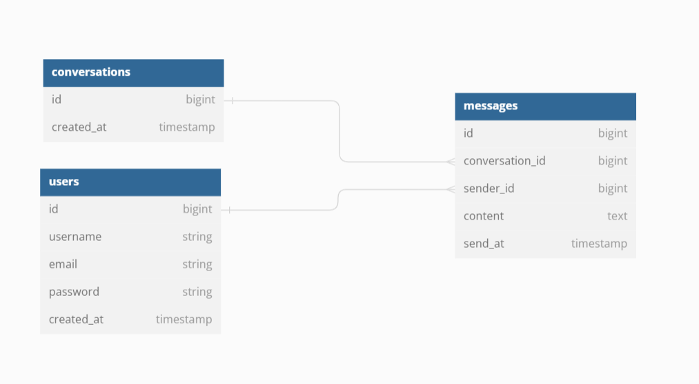

# Simple Chat App
This project is a simple chat app built with Fiber and MySQL, implementing clean architecture.

## Entity Relationship Diagram


## SQL Scripts
You can see on db/migrations folder as migration using package github.com/golang-migrate/migrate, but here is a full query for database tables.
```mysql
-- Create Users table using InnoDB engine
create table users
(
    id         bigint not null auto_increment,
    username   varchar(20) not null,
    email       varchar(100) not null,
    password   varchar(50) not null,
    created_at timestamp       not null,
    primary key (id)
) engine = InnoDB;

-- Create Conversation table using InnoDB engine
create table conversations
(
    id         bigint not null auto_increment,
    created_at timestamp       not null,
    primary key (id)
) engine = InnoDB;

-- Create Messages table using InnoDB engine
create table messages
(
    id         bigint not null auto_increment,
    conversation_id   bigint not null,
    sender_id       bigint not null,
    content   text not null,
    send_at timestamp       not null,
    primary key (id)
) engine = InnoDB;

-- Create Foreign Key for Messages Table
alter table messages add constraint fk_users_messages foreign key (sender_id) references users(id);
alter table messages add constraint fk_conversations_messages foreign key (conversation_id) references conversations(id);
```
You can remove engine = InnoDB for flexibility SQL Script.

## Installation

Clone Repository

```git
  git clone github.com/raamaj/chat-app
```

### Development
Install Dependencies
```bash
  go mod download
```

Migrate Database
```bash
  make migrate-up
```

Run Code with Air
```bash
  make air-run
```
> Check MakeFile for other migration like create migration, status, down or reset, or you can run ```make help```  on cmd for other command

### Deployment
Run Docker Compose
```bash
  docker-compose -p "chat-app-container" up
  
  # or using make
  
  make deploy
```

## API Documentation
This project using generated swagger file using swaggo package, here is URL of API Documentation
```
http://127.0.0.1:9000/api/docs
```